<li><a href="#hoisting">Hoisting</a></li>
<li><a href="#letAndConst">Difference between let and const</a></li>
<li><a href="#TDZ">Temporal Dead Zone</a></li>
<li><a href="#EventLoop">What is Event loop?</a></li>
<li><a href="#jsDataTypes">JavaScript Data Type</a></li>
<li><a href="#restAndSpread"> Rest Operators and Spread Operators</a></li>
<li><a href="#deepAndShallow">Deep Copy And Shallow Copy</a></li>
<li><a href="#closure">Closure</a></li>
<li><a href="#promise">Promise</a></li>
<li><a href="#asyncAwait">Async/await</a></li>
<li><a href="#callback-hell">Callback Hell</a></li>
<li><a href="#curring">Curring</a></li>
<li><a href="#curring_problem">Solve the mul(2)(3)(4)</a></li>
<li><a href="#iife">IIFE</a></li>
<li><a href="#prototype">Prototype and __proto__</a></li>
<li><a href="#event">Event Delegations, Event Bubbling and Event Capturing</a></li>
<li><a href="#treeShaking">Tree Shaking</a></li>
<li></li>
<li></li>
<li></li>

# Hoisting
Hoisting is a process where JavaScript moves all the declarations of functions and variables to the top of their scope during Compilation Phase.

## How Hoisting is Working:
A javascript Program is running into two phases 1. Compilation Phase 2. Execution Phase
1. **Compilation Phase (Memory Allocation)**: 
**When does it happen?**
Before the code starts running (when the script is loaded).

**What happens in this phase?**

Memory Allocation: Variables, functions, and classes are scanned and allocated memory.
Hoisting: Function declarations, var, let, const, and class declarations are "hoisted" to the top of their scope.
Scope Creation: The execution context (Global or Function) is created, and the Lexical Environment is set up.

2. **Execution Phase (Code Execution)**:
**When does it happen?**
After the compilation phase, once the execution context is ready, JavaScript starts running the code line-by-line.

**What happens in this phase?**

Code Execution Line-by-Line: The interpreter reads and executes each line of code.
Initialization and Assignment: Variables that were allocated during the compilation phase are now assigned values.
Function Calls: When a function is called, a new execution context is created for that function.
Garbage Collection: After execution, unused variables and references are cleaned up to free memory.

in the above example. There is a variable "a" which is declared in the compilation phase
variable a allocate some memory in the execution context and assigned with the value 'undefined'
when the execution phase is running then first console log is run and it throw the value undefined.

# Difference between let and const
Let and const are both ES6 features, both refer to the local and block scope. 
The only difference between them is that, we can re-assign the value of the variable that 
is declared with the let but with const we can’t re-assign the variable's value.

Both let and const are hoisted to the top of their scope, but they are not initialized. 
They remain in the Temporal Dead Zone (TDZ) until the line of code where they are declared is executed.

# Temporal Dead Zone
The concept of the Temporal Dead Zone (TDZ) in JavaScript refers to the time 
between entering a scope (like a block or function) and the point where a 
variable declared with let or const is initialized. During this time, the 
variable is in an uninitialized state and cannot be accessed. 
Attempting to access the variable during the TDZ will result in a ReferenceError.

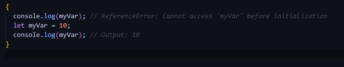

### Key Points About the Temporal Dead Zone
1. **Scope is Block-Level**: Variables declared with let and const are block-scoped 
    and enter the TDZ from the start of their enclosing block until their initialization.

2. **Access During TDZ is an Error**: Accessing a variable in the TDZ throws a ReferenceError.

3. **Variable Hoisting**: While variables declared with let and const are hoisted to the 
    top of their scope, they are not initialized and remain in the TDZ.

# Event Loop

Event loop is the process in the javascript which takes care for the selection of job take place at what time.
It is responsible for execution of non-blocking code.

### What is the precedence in the Event loop?
Event loop always check if the call stack is empty or not if the call stack is empty then it goes for 
the callback queue for the execution of non-blocking callbacks.but if there is any promise code 
then event loop first take care of micro-task queue and then callback queue.

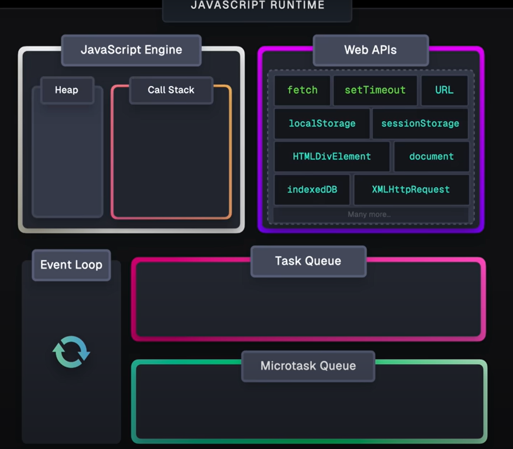

# JavaScript Data Types
In JavaScript, data types are divided into two main categories:

1. **Primitive Data Types (Simple, Immutable)**:

These are simple, immutable data types that store single values.
JavaScript has 7 primitive data type.

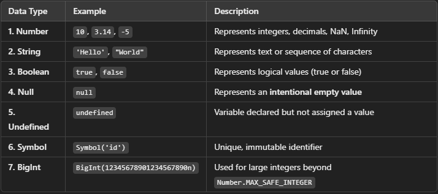

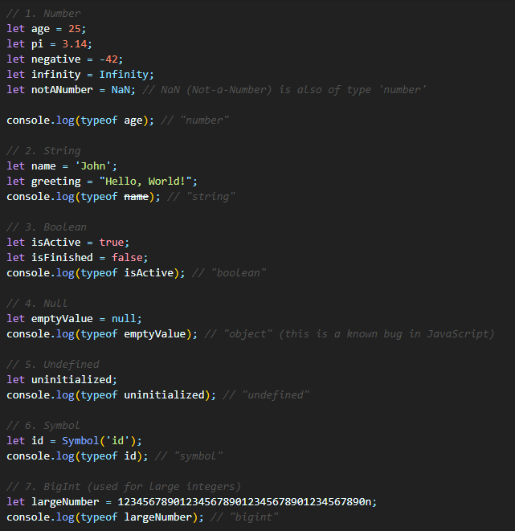

2. **Non-Primitive Data Types (Complex, Mutable)**:

These are complex, mutable data types that store collections of values or objects

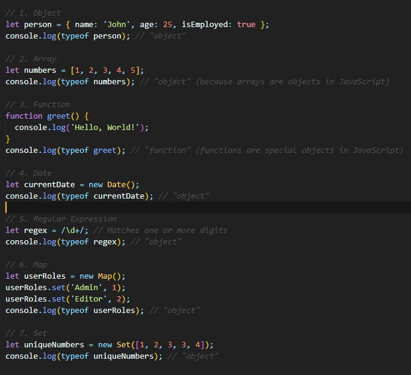

### Difference Between Primitive and Non-Primitive Type

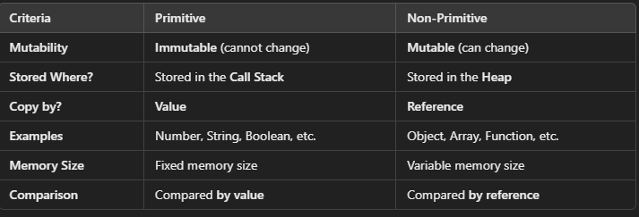

## Rest Operators
The rest operator collects multiple elements into a single array or object. 
It is used in function parameter lists or destructuring assignments to handle an indefinite number of elements.

**Usage in Function Parameter**: It collects arguments in an array

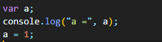

**Usage in Destructuring**: It collect the rest of the property or elements

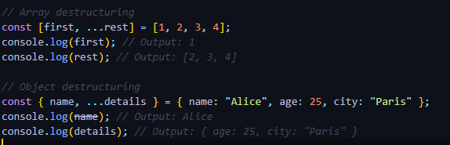 

## Spread Operators
The spread operator expands an array or object into individual elements. 
It is used in arrays, objects, and function calls to "spread" values.

**Usage in Arrays**:
It spread array elements

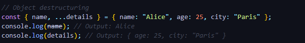

**Usage in Objects**:
It spread object elements

**Usage in function Calls**:
It spread array elements as arguments

## The Key Difference between rest Operator and Spread Operator is:
**Rest Operator** gathers multiple elements into one where as
**Spread Operator** spread multiple elements into individual one.

# Shallow Copy
A shallow copy duplicates the outermost structure but not the nested objects or arrays inside it. 
If the original object contains references to other objects, those references are shared between the 
original and the copy. Changes to nested objects will affect both the original and the copy.

1. using Object spread operator

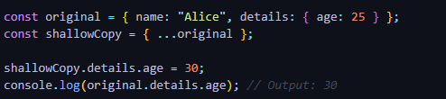

2. using Object.assign

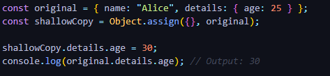

3. Array example

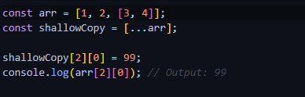

# Deep Copy
A deep copy duplicates the entire structure, including nested objects and arrays. 
Changes to the copied object or its nested properties do not affect the original.

1. Using JSON.parse and JSON.stringify

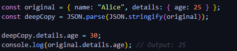

2. Using a Library (e.g Lodash)

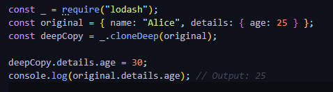

**Limitations**:

1. Cannot handle functions or undefined.
2. Loses reference to classes or special objects (like Date).

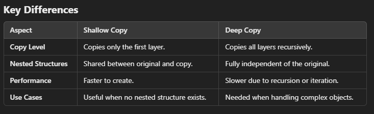

# Closure

A closure in JavaScript is a feature where an inner function "remembers" and can access variables from 
its outer function's scope even after the outer function has finished executing. 
This allows functions to retain access to their defining scope, creating a persistent environment.

## How Closures Work
1. A function is created inside another function.
2. The inner function retains access to the outer function’s variables and parameters.
3. Even if the outer function has returned, the inner function can still access those variables.

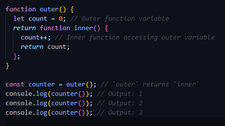

### Key Takeaways
1. Closures "remember" the scope where they were created.
2. They are powerful for creating encapsulated and modular code.
3. Use them carefully to avoid potential pitfalls like excessive memory usage or bugs caused by unexpected variable references.

# Promise

A Promise in JavaScript represents the eventual completion (or failure) of an asynchronous 
operation and its resulting value. Promises are a built-in feature introduced in ES6 to 
handle asynchronous operations in a more organized and manageable way compared to 
traditional callback functions.
1. **Handling Asynchronous Operations**: Promises provide a way to work with asynchronous 
    code in a more sequential and readable manner.
2. **States**: Promises have three possible states: pending (initial state), 
    fulfilled (operation completed successfully), and rejected (operation failed).
3. **Methods**: Promises have methods like then() to handle successful completion, 
    catch() to handle errors, and finally() to execute code after either fulfillment or rejection.

    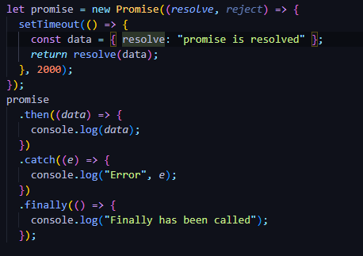

# Async/await

async and await are newer features introduced in ES8/ES2017 that provide a more 
concise and cleaner syntax for working with promises and asynchronous code.

**Syntax**: async functions return a promise implicitly and allow the use of await
within them to pause execution until a promise settles (either resolves or rejects).

**Sequential Code**: await can be used to write asynchronous code that looks and 
behaves like synchronous code, making it easier to understand and maintain.

**Error Handling**: Error handling is simplified using try-catch blocks around await expressions.

  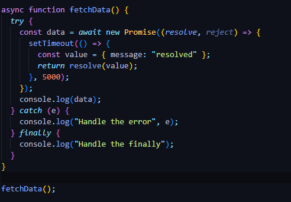

# Callback Hell

**Callback hell** is a term used to describe a situation in asynchronous programming where 
multiple nested callbacks make the code difficult to read and maintain. This typically occurs 
when you have a sequence of asynchronous operations that depend on the result of the previous 
operation, leading to deeply nested callback functions. This nesting can lead to code that 
is hard to follow and debug, often referred to as "pyramid of doom."

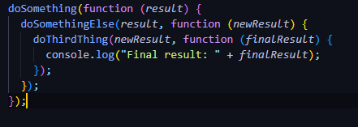

As the number of nested callbacks increases, the code becomes more complex and harder to maintain.

# Curring
**Currying** is the process of taking a function with multiple arguments and 
turning it into a sequence of functions each with only a single argument.

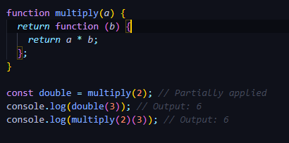

### Why Use Currying?
1. **Reusability**: You can create specialized functions by partially applying arguments.

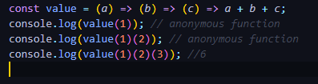

2. **Readability**: Makes function chaining and composition easier.

3. **Immutability**: Helps to write pure functions with predictable outcomes.

### Key Takeaways
1. Currying transforms a multi-argument function into a chain of single-argument functions.
2. Useful for function composition, partial application, and creating more reusable, readable code.
3. Can be implemented manually or through libraries like Lodash (_.curry).

# 
### Solve the mul(2)(3)(4)

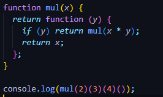

#

# IIFE (Immediately Invoked Function Expression) 
IIFE is a JavaScript function that runs as soon as it is defined.
It allows you to create a private scope to avoid polluting the global namespace and execute code directly
The signature of it would be as below,

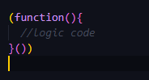

### Why Use IIFE?

1. **Avoid Global Scope Pollution**
Variables inside the IIFE are not accessible outside, keeping the global namespace clean.

2. **Data Privacy**
Encapsulates code to create private variables and functions.

3. **Module Pattern**
Used for creating modules before ES6 modules were introduced.

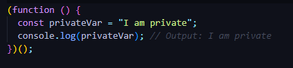

# Prototype
The prototype is an object that is associated with every function and object by default. 
When a function is used as a constructor (with the new keyword), the newly created 
object inherits properties and methods from the constructor's prototype.

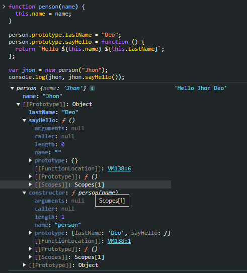

# __proto__: 
The __proto__ property is an internal property of an object that points to 
the prototype object from which it inherits properties and methods. 
This property is part of the prototype chain mechanism.

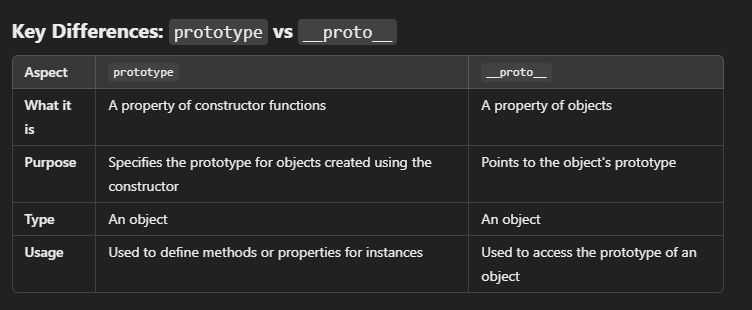

# Prototype Chain

The prototype chain is the mechanism by which JavaScript objects inherit properties 
and methods from other objects. When you try to access a property or method of an object, 
JavaScript first looks at the object itself. If the property or method is not found, 
it looks at the object's prototype (__proto__). This process continues up the 
chain until the property or method is found or until the chain ends with null.

# Event Delegation

Event delegation is a technique in JavaScript where you attach an event 
listener to a parent element instead of attaching event listeners to multiple 
child elements individually. This parent element then listens for events bubbling 
up from its children. When an event occurs, it can be handled by checking the 
event target (the element that triggered the event) and deciding what action to take based on the target.

### Event delegation is particularly useful in scenarios where:

1. **Dynamic Content**: When elements are added or removed dynamically, event delegation ensures 
that newly added elements automatically have event listeners without needing to attach listeners manually.

2. **Performance**: It reduces the number of event listeners, which can improve performance, 
especially when dealing with large numbers of elements.

3. **Simplicity**: It simplifies event management, especially in complex DOM structures 
or single-page applications where managing individual event listeners for each element can become cumbersome.

# Event Bubbling
Event bubbling is the default behavior in which an event triggered on a nested element 
propagates upwards through its ancestors in the DOM tree. After the event handler on the 
target element executes, the event bubbles up to its parent element, then to the parent's parent, 
and so on, until it reaches the root of the document (<html>).

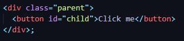

If you click the "Click Me" button (button id="child"), 
the event handling sequence in bubbling would be:

1. Event triggered on #child (button).
2. Event handler on #child executes.
3. Event bubbles up to #parent (div).
4. Event handler on #parent executes (if present).
5. Event continues to bubble up to the document root (<html>) and then to window.

# Event Capturing

Event capturing is the opposite of event bubbling. In event capturing, 
the event is first captured by the outermost element (window), then propagated 
downwards through its descendants to the target element. This phase 
occurs before the actual event reaches the target element.

# Tree Shaking

**Tree shaking** is a term used in the context of JavaScript module bundling 
(like with tools such as Webpack or Rollup). It refers to the process of eliminating 
dead code (unused modules or code paths) from your final bundle. This optimization 
technique helps reduce the bundle size, improving load times and overall application performance.

### How Tree Shaking Works
1. **Module System**: Tree shaking works best with ES6 modules (import/export syntax) 
because it relies on static analysis of the code's import/export statements 
to determine which modules are actually used.

2. **Static Analysis**: During the bundling process, the bundler (e.g., Webpack) 
statically analyzes the code to create a dependency graph of all modules and their dependencies.

3. **Unused Code Detection**: The bundler then identifies which modules and parts of 
modules are not imported or used anywhere in the application.

4. **Dead Code Elimination**: Modules and code paths that are identified as unused are 
eliminated (shaken off) from the final bundle. This reduces the bundle size without 
impacting the functionality of the application.

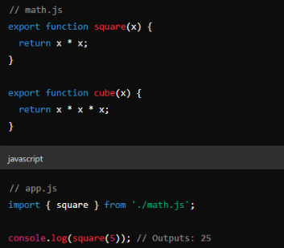

In this example, if cube function from math.js is not used anywhere else in the application, 

a properly configured bundler with tree shaking enabled will exclude the cube function from the final bundle.

