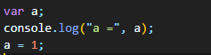

<li><a href="#hoisting">Hoisting</a></li>
<li><a href="#letAndConst">Difference between let and const</a></li>
<li><a href="#EventLoop">What is Event loop?</a></li>
<li></li>
<li></li>
<li></li>
<li></li>
<li></li>

# Hoisting
Hoisting is a process where JavaScript moves all the declarations of functions and variables to the top of their scope during Compilation Phase.

## How Hoisting is Working:
A javascript Program is running into two phases 1. Compilation Phase 2. Execution Phase
1. **Compilation Phase (Memory Allocation)**: 
**When does it happen?**
Before the code starts running (when the script is loaded).

**What happens in this phase?**

Memory Allocation: Variables, functions, and classes are scanned and allocated memory.
Hoisting: Function declarations, var, let, const, and class declarations are "hoisted" to the top of their scope.
Scope Creation: The execution context (Global or Function) is created, and the Lexical Environment is set up.

2. **Execution Phase (Code Execution)**:
**When does it happen?**
After the compilation phase, once the execution context is ready, JavaScript starts running the code line-by-line.

**What happens in this phase?**

Code Execution Line-by-Line: The interpreter reads and executes each line of code.
Initialization and Assignment: Variables that were allocated during the compilation phase are now assigned values.
Function Calls: When a function is called, a new execution context is created for that function.
Garbage Collection: After execution, unused variables and references are cleaned up to free memory.

in the above example. There is a variable "a" which is declared in the compilation phase
variable a allocate some memory in the execution context and assigned with the value 'undefined'
when the execution phase is running then first console log is run and it throw the value undefined.

# Difference between let and const
Let and const are both ES6 features, both refer to the local and block scope. 
The only difference between them is that, we can re-assign the value of the variable that 
is declared with the let but with const we can’t re-assign the variable's value.

Both let and const are hoisted to the top of their scope, but they are not initialized. 
They remain in the Temporal Dead Zone (TDZ) until the line of code where they are declared is executed.

# Event Loop

Event loop is the process in the javascript which takes care for the selection of job take place at what time.
It is responsible for execution of non-blocking code.

### What is the precedence in the Event loop?
Event loop always check if the call stack is empty or not if the call stack is empty then it goes for 
the callback queue for the execution of non-blocking callbacks.but if there is any promise code 
then event loop first take care of micro-task queue and then callback queue.

