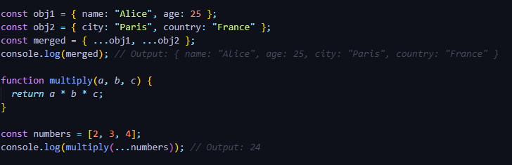

<li><a href="#hoisting">Hoisting</a></li>
<li><a href="#letAndConst">Difference between let and const</a></li>
<li><a href="#EventLoop">What is Event loop?</a></li>
<li><a href="#jsDataTypes">JavaScript Data Type</a></li>
<li><a href="#restAndSpread"> Rest Operators and Spread Operators</a></li>
<li><a href="#deepAndShallow">Deep Copy And Shallow Copy</a></li>
<li></li>
<li></li>

# Hoisting
Hoisting is a process where JavaScript moves all the declarations of functions and variables to the top of their scope during Compilation Phase.

## How Hoisting is Working:
A javascript Program is running into two phases 1. Compilation Phase 2. Execution Phase
1. **Compilation Phase (Memory Allocation)**: 
**When does it happen?**
Before the code starts running (when the script is loaded).

**What happens in this phase?**

Memory Allocation: Variables, functions, and classes are scanned and allocated memory.
Hoisting: Function declarations, var, let, const, and class declarations are "hoisted" to the top of their scope.
Scope Creation: The execution context (Global or Function) is created, and the Lexical Environment is set up.

2. **Execution Phase (Code Execution)**:
**When does it happen?**
After the compilation phase, once the execution context is ready, JavaScript starts running the code line-by-line.

**What happens in this phase?**

Code Execution Line-by-Line: The interpreter reads and executes each line of code.
Initialization and Assignment: Variables that were allocated during the compilation phase are now assigned values.
Function Calls: When a function is called, a new execution context is created for that function.
Garbage Collection: After execution, unused variables and references are cleaned up to free memory.

in the above example. There is a variable "a" which is declared in the compilation phase
variable a allocate some memory in the execution context and assigned with the value 'undefined'
when the execution phase is running then first console log is run and it throw the value undefined.

# Difference between let and const
Let and const are both ES6 features, both refer to the local and block scope. 
The only difference between them is that, we can re-assign the value of the variable that 
is declared with the let but with const we can’t re-assign the variable's value.

Both let and const are hoisted to the top of their scope, but they are not initialized. 
They remain in the Temporal Dead Zone (TDZ) until the line of code where they are declared is executed.

# Event Loop

Event loop is the process in the javascript which takes care for the selection of job take place at what time.
It is responsible for execution of non-blocking code.

### What is the precedence in the Event loop?
Event loop always check if the call stack is empty or not if the call stack is empty then it goes for 
the callback queue for the execution of non-blocking callbacks.but if there is any promise code 
then event loop first take care of micro-task queue and then callback queue.

# JavaScript Data Types
In JavaScript, data types are divided into two main categories:

1. **Primitive Data Types (Simple, Immutable)**:

These are simple, immutable data types that store single values.
JavaScript has 7 primitive data type.

2. **Non-Primitive Data Types (Complex, Mutable)**:

These are complex, mutable data types that store collections of values or objects

### Difference Between Primitive and Non-Primitive Type

## Rest Operators
The rest operator collects multiple elements into a single array or object. 
It is used in function parameter lists or destructuring assignments to handle an indefinite number of elements.

**Usage in Function Parameter**: It collects arguments in an array

**Usage in Destructuring**: It collect the rest of the property or elements
 

## Spread Operators
The spread operator expands an array or object into individual elements. 
It is used in arrays, objects, and function calls to "spread" values.

**Usage in Arrays**:
It spread array elements

**Usage in Objects**:
It spread object elements

**Usage in function Calls**:
It spread array elements as arguments

## The Key Difference between rest Operator and Spread Operator is:
**Rest Operator** gathers multiple elements into one where as
**Spread Operator** spread multiple elements into individual one.

# Shallow Copy
A shallow copy duplicates the outermost structure but not the nested objects or arrays inside it. 
If the original object contains references to other objects, those references are shared between the 
original and the copy. Changes to nested objects will affect both the original and the copy.

1. using Object spread operator

2. using Object.assign

3. Array example

# deep Copy
A deep copy duplicates the entire structure, including nested objects and arrays. 
Changes to the copied object or its nested properties do not affect the original.

1. Using JSON.parse and JSON.stringify

2. Using a Library (e.g Lodash)

**Limitations**:

1. Cannot handle functions or undefined.
2. Loses reference to classes or special objects (like Date).

