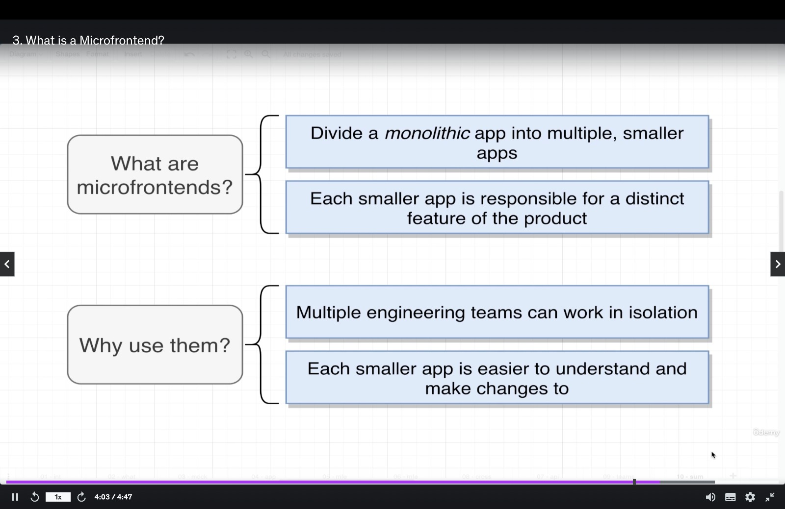
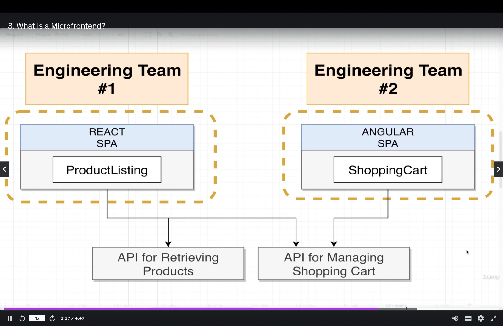

<li><a href="#mfe">What is Micro front end?</a></li>
<li><a href="#hostAndremote">What is Host and Remote in MFE?</a></li>
<li><a href="#diffIntegration">What are the difference between Run time integration and Build-Time Integration</a></li>
<li><a href="">Shared Module Versioning</a></li>
<li><a href="">Singleton Loading in MFE</a></li>
<li><a href="">Sub-App Execution Context</a></li>
<li></li>
<li></li>
<li></li>
<li></li>

# Micro-front End: 
Micro frontends (MFE) is an architectural style in frontend development where a large, monolithic 
application is divided into smaller, independently developed, tested, and deployed frontend 
components or applications. These smaller applications, often referred to as "micro apps," work together
to form a cohesive user experience, similar to the microservices architecture in backend development.

## Key Features of Micro Frontends:
1. **Independence**: Each micro frontend is developed and deployed independently by different teams.
2. **Technology Agnostic**: Teams can use different frameworks, libraries, or tools for their micro 
apps as long as they adhere to agreed integration contracts.
3. **Decentralized Ownership**: Different teams own specific features or functionalities of the application.
4. **Resilience**: Issues in one micro frontend typically do not affect others, improving fault tolerance.

## Benefits of Micro-front End:
1. **Scalability**: Teams can work on different parts of the application simultaneously.
2. **Flexibility**: Teams can adopt the best tools and technologies for their specific needs.
3. **Faster Deployment**: Micro apps can be updated independently, leading to quicker releases.
4. **Maintainability**: Smaller codebases are easier to manage and debug.

## Challenges with Micro-front End:
a. **Complexity**: Managing multiple repositories, deployments, and integrations can increase complexity.
b. **Performance**: Combining multiple micro apps on the client-side or server-side can impact performance.
c. **Consistency**: Ensuring a uniform look and feel across micro apps requires additional effort.

## Integration Techniques of Micro-front End:
a. **Client-Side Composition**: Each micro app is loaded dynamically in the browser 
(e.g., using iframes or JavaScript frameworks).
b. **Server-Side Composition**: The server combines micro apps into a single HTML page before sending
it to the browser.
c. **Build-Time Composition**: Micro apps are integrated during the build process into 
a single deployable artifact.

## Popular Tools & Frameworks:
1. **Module Federation (Webpack)**: Enables sharing and dynamic loading of modules across applications.
2. **Single-SPA**: A framework for orchestrating multiple micro frontends.
3. **Qiankun**: A micro frontend framework built on top of Single-SPA.
4. **Web Components**: Standardized browser APIs to create reusable, encapsulated components.

## Host And Remotes
A micro frontend setup typically consists of a host (container) application and 
several micro apps (remotes). The host application acts as the shell or orchestrator, 
while the micro apps are independently developed and deployed. Below is an example 
using Webpack Module Federation, which is a popular technique for implementing micro frontends

# Build-Time Integration
Micro frontends are integrated during the build process. The individual micro apps are
bundled together into a single deployable artifact, typically at the time of deployment.

## Key Features:
1. **Static Composition**: The integration occurs at the build stage.
2. **Tight Coupling**: All micro apps need to be built and deployed together.
3. **Shared Build Pipelines**: Common tools and dependencies are used.
## Advantages:
1. **Performance**: Since everything is bundled, no additional runtime logic is 
required to combine micro apps. This can lead to faster loading.
2. **Simpler Deployment**: A single artifact is deployed, simplifying the deployment process.
3. **Uniform Environment**: All micro apps share the same build environment, avoiding version mismatches.
## Disadvantages:
a. **Lack of Independence**: Micro apps cannot be deployed independently, as they are bundled together.
b. **Slower Updates**: Any change in a micro app requires rebuilding and redeploying the entire application.

# Run-Time Integration
Micro frontends are integrated dynamically at runtime, meaning the host (or container) 
application fetches and loads the micro apps during execution.

## Key Features:
1. **Dynamic Composition**: Micro apps are loaded on demand.
2. **Loose Coupling**: Micro apps are developed, built, and deployed independently.
3. **Dynamic Updates**: Micro apps can be updated independently without rebuilding the host.

## Advantages:
1. **Independent Deployment**: Teams can work and deploy micro apps independently.
2. **Scalability**: Ideal for large teams with diverse technology stacks.
3. **Dynamic Updates**: A single micro app can be updated without affecting the rest of the system.

## Disadvantages:
1. **Complexity**: Requires additional infrastructure for dynamic loading and orchestration.
2. **Performance Overhead**: Loading micro apps dynamically may increase load times.
3. **Version Mismatches**: Shared dependencies across micro apps need careful version management.

