# React-Js

<li><a href="#details_react">Details about React js</a></li>
<li><a href="#state_full_and_state_less">StateFull and Stateless component</a></li>
<li><a href="#controlled_component">Controlled Component and UnControlled Component</a></li>
<li><a href="#react_fiber">React Fiber</a></li>
<li><a href="#vdom">Virtual DOM</a></li>
<li><a href="#reconciliation">Reconciliation</a></li>
<li><a href="#diffing_algorithm">Diffing algorithm</a></li>
<li><a href="#use_effect">useEffect Hook</a></li>
<li><a href="#useState">useState Hook</a></li>
<li><a href="use_reducer">useReducer Hook</a></li>
<li><a href="#use_ref">useRef Hook</a></li>
<li><a href="#use_memo">useMemo Hook</a></li>
<li><a href="#use_callback">useCallback Hook</a></li>
<li><a href="#optimization_methods">Optimization Methods of a website in React</a></li>
<li><a href="#pure_component">Pure Component</a></li>
<li><a href="#higher_o_component">Higher Order Component</a></li>
<li><a href="#throttling_and_debouncing">Throttling and debouncing</a></li>
<li><a href="#class_functional_component">Difference between Class Based and Functional based Component</a></li>
<li></li>

# Details about React js

**React** is a popular JavaScript library for building user interfaces, particularly for single-page applications
where you need a dynamic, responsive, and interactive experience.
Developed and maintained by Facebook, React allows developers to create large web applications
that can update and render efficiently in response to data changes without reloading the page.

#### Key Features of React:

1. **Component-Based Architecture**: React encourages developers to break down the UI into reusable components.
   Each component is like a small, self-contained piece of the UI that can be composed to form complex UIs

2. **JSX (JavaScript XML)**: React uses JSX, a syntax extension that allows you to write HTML-like code
directly within JavaScript. JSX makes the code easier to understand and allows for seamless
integration of HTML with JavaScript logic.

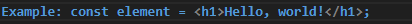

3. **Virtual DOM**: React uses a Virtual DOM, which is a lightweight representation of the actual DOM.
4. **Unidirectional Data Flow**: In React, data flows in a single direction, from parent to child components.
   This makes it easier to debug the application.
5. **React Hooks**: Hooks are functions that let you use state and other React features in functional components.
   Hooks like useState and useEffect allow you to add state management and side effects to functional
   components without writing classes.

   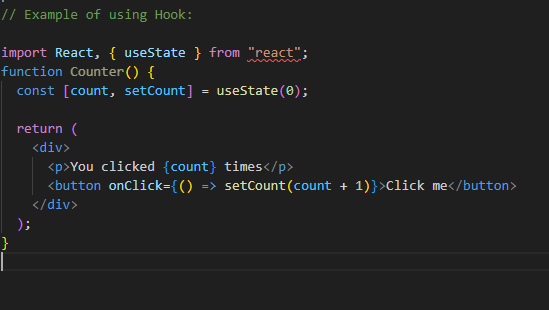

#### Use Cases for React:

1. Single-page applications (SPAs)
2. Mobile applications (using React Native)
3. Complex and dynamic web interfaces
4. Building reusable UI components

Overall, React has become a standard tool in modern web development due to its flexibility, performance, and ease of use.

# Stateful component and Stateless component:

If the component depends on the state of the component, it is called a **stateful component**.
**Features:** 
1. **Manages State:** Uses useState, useReducer, or other hooks that manage state in functional components.
In class components, state is managed using this.state and this.setState. 
2. **Lifecycle Methods:** In class components, stateful components often use lifecycle methods
(e.g., componentDidMount, componentDidUpdate, componentWillUnmount). In functional components,
you can achieve similar effects with the useEffect hook. 
3. **Dynamic:** Since the component's state can change, the rendered output can also change over time,
making it dynamic.

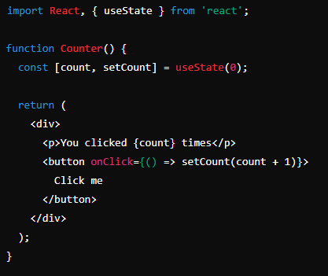

If the component is independent of the state of the component then it is called a **stateless component**.
**Features:** 
1. **No State:** Stateless components don't manage or store state internally. 
2. **Pure Components:** Often implemented as pure functions, meaning they always produce the same output given
the same input (props). 
3. **Simpler and Reusable:** Since they don't manage state, they're generally simpler and more reusable.

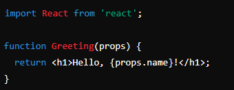

# Controlled and UnControlled Component 

**Controlled Component**: those components that are controlled by input elements within the form or user input.

1. At first we initialize a state using useState
2. Set the value of the form using props
3. Write an handler function to update the state
4. Attach the handle function with the input element.

**Uncontrolled Component:** thoses component which has its own store for handling event. Like ref.
1. At first we create a ref using useRef.
2. Attached that ref to the form.
3. Ref will have an internal handle which update the value of current on changing the value.

# React Fiber

**React fiber** is the new implementation or core algorithm of React v16. Which is used to increase the suitability
areas like gesture, animation, ability to pause, abort work, prioritize the work and divide the work into chunks.

**React Fiber** is a complete rewrite of React's core algorithm, introduced in React v16. It was designed to address
limitations in the previous reconciliation algorithm and to improve various aspects of React's performance and
capabilities.

#### Key Features of React Fiber

1. **Concurrency**: React Fiber enables React to pause, abort, or re-prioritize work. This allows React to handle
   complex user interactions (like gestures and animations) more smoothly by breaking work into smaller units and
   prioritizing critical updates.
2. **Incremental Rendering**: Fiber allows React to divide the work into chunks and spread it out over multiple frames.
   This improves the responsiveness of the UI by making rendering more interruptible and ensuring that updates do not
   block the main thread for too long.
3. **Priority-Based Updates**: React Fiber introduces the concept of prioritizing updates based on their importance.
   For instance, user interactions (such as clicks or typing) can be given higher priority than background data
   fetching, ensuring a smoother and more responsive user experience.
4. **Error Handling**: Fiber improves error handling by enabling better recovery mechanisms and making it easier to
   catch errors within components.
5. **Flexible Rendering**: Fiber provides the ability to render asynchronously, allowing React to adjust and optimize
   rendering based on the current state of the application and user interactions.

# Virtual DOM

The Virtual DOM (VDOM) is an in-memory representation of the real DOM elements. It acts as an intermediary between
the application and the browser's actual DOM, helping to optimize updates and rendering for performance.

**Here's how it works:**

1. **Initial Render**: When a React component is rendered for the first time, a Virtual DOM tree is created that
   mirrors the structure of the actual DOM.

2. **Changes and Updates**: When changes occur in the component state or props, a new Virtual DOM tree is created.

3. **Reconciliation**: React then compares this new Virtual DOM tree with the previous one using a process called
   "reconciliation". This comparison is efficient due to React's use of a diffing algorithm that identifies the
    minimum number of changes needed.

4. **Patching the Real DOM**: After identifying the changes, React updates the actual DOM only where necessary,
   ensuring minimal manipulation and improving performance.

**Here's a step-by-step summary of the process:**

1. **State/Prop Change**: A change in state or props triggers a re-render in React.
2. **Virtual DOM Update**: React creates a new Virtual DOM tree based on the updated state/props.
3. **Diffing Algorithm**: React compares the new Virtual DOM tree with the previous one to identify differences.
4. **Batch Updates**: React efficiently updates the real DOM by applying only the necessary changes.

This approach minimizes direct DOM manipulations, making updates more efficient and improving the
overall performance of the application.

# Reconciliation

**Reconciliation** is the step that happens between the render function being called and the final elements displayed
    on the screen. This entire process is known are reconciliation. It involves comparing the new Virtual DOM with the
    previous one and efficiently updating the real DOM to reflect any changes. This ensures optimal performance
    by minimizing direct DOM manipulations.

**How Reconciliation Works**

1. **Rendering Phase**:
    <li>When a component's state or props change, React triggers a re-render of that component.</li>
    <li>The component's render() function (or the functional component itself) returns a new virtual DOM tree.</li>

2. **Comparing the Virtual DOM**:
    <li>React compares the new virtual DOM tree with the previous one (this process is called "diffing").</li>
    <li>It checks for differences between the two trees, such as changes in elements, attributes, or text content.</li>

3. **Updating the DOM**:
    <li>After identifying the differences, React updates only the parts of the actual DOM that have changed.</li>
    <li>This efficient updating minimizes reflows and repaints, leading to better performance.</li>

#### Key Concepts in Reconciliation

1. **Virtual DOM**: The virtual DOM is an in-memory representation of the real DOM.
   React uses it to track changes in the UI without directly interacting with the real DOM until necessary.

2. **Diffing Algorithm**: React uses a highly optimized diffing algorithm to compare the new virtual DOM with
   the previous one. It assumes that elements with the same type and key will be the same, and it only
   updates those parts that have changed.

3. **Keys**: Keys are crucial in helping React identify which elements have changed, been added, or been removed.
   They are especially important when rendering lists of elements. React uses keys to track elements
   between renders to avoid unnecessary re-renders.

#### Example of Reconciliation

 
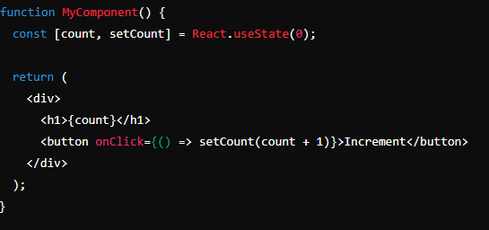

<li>    Initially, React renders the h1 element with the value 0.</li>
<li>    When the button is clicked, setCount updates the state to 1.</li>
<li>    React generates a new virtual DOM where the h1 element has the value 1.</li>
<li>    React compares the new virtual DOM with the old one and determines that only the text content inside the 
    h1 element has changed.</li>
<li>    React then updates the DOM by changing the text content of the h1 element from 0 to 1, 
    without re-rendering the entire div.</li>

# Diffing algorithm

The primary algorithm used in React for reconciliation is the diffing algorithm. 

Here's an overview of the diffing algorithm and its complexity:

**React's Diffing Algorithm**
React employs a heuristic O(n) algorithm to compare the new and old Virtual DOM trees. 

#### The key aspects of this algorithm include:
**Element Type Comparison:** If the elements have different types, React assumes the entire subtree is different and 
replaces the old tree with the new one. This operation is relatively straightforward and efficient.

**Keys for List Elements:** For lists of elements, React uses keys to track which items have changed, been added, 
or been removed. Keys help React identify items efficiently, reducing the complexity of updating lists from O(n^3) 
(which would be required for a naive deep comparison of two trees) to O(n).

**Child Elements:** If the elements have the same type, React recursively steps into the children and compares them.

#### Complexity
Worst-case complexity: O(n), where n is the number of elements in the Virtual DOM tree

# useEffect Hook

The useEffect hook in React serves a similar purpose to several lifecycle methods in class components. 
It allows you to perform side effects in function components, and its behavior can be mapped to different 
phases of the component lifecycle. Here's how useEffect fits into the lifecycle methods:

### Equivalent Class Component Lifecycle Methods
1. **Component Did Mount (componentDidMount)**
2. **Component Did Update (componentDidUpdate)**
3. **Component Will Unmount (componentWillUnmount)**

#### useEffect Usage and Lifecycle Mapping
1. **Initial Render (componentDidMount)**: To perform an action only once after the initial render 
    (similar to componentDidMount), you can pass an empty dependency array [] to useEffect:

    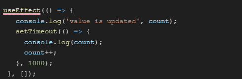

2. **Subsequent Renders (componentDidUpdate)**: To run side effects after every render 
    (or when specific dependencies change), include those dependencies in the dependency array:

    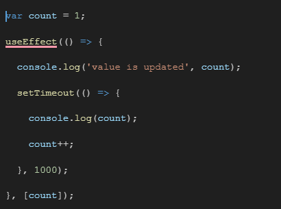

    If you want to perform an action after every render (regardless of dependencies), omit the dependency array:

    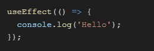

3. **Cleanup (componentWillUnmount)**: To clean up after a component is removed from the DOM 
    (similar to componentWillUnmount), return a cleanup function from useEffect:

    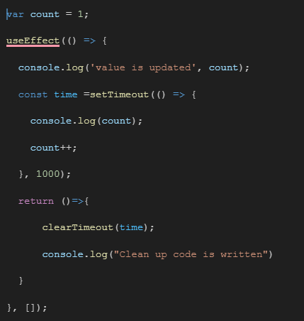

# useState Hook

The useState hook is one of the most fundamental hooks in React. It allows you to add state to functional components.

**How useState Works**
When you call useState, it returns an array with two elements:

1. The current state value: This is the current value of the state.
2. A function to update the state: This function is used to update the state value and trigger a re-render of 
    the component.

**Syntax**:
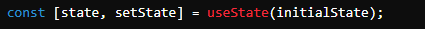

1. **state**: The current state value.
2. **setState**: The function you use to update the state.
3. **initialState**: The initial value of the state, which can be a primitive value, object, array, 
or any other data type. 

##### Example Usage
**Basic Counter Example**

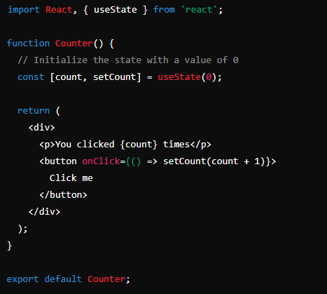

**Initial State**: useState(0) initializes the count state variable to 0. 

**Updating State**: setCount(count + 1) updates the count state variable when the button is clicked, 
incrementing it by 1.

### Important Points
**State is Preserved Across Renders**: The value returned by useState is preserved between renders. 
Each time the state is updated, the component re-renders with the new state value.
**Updating State Triggers a Re-render**: When you call the state updater function returned by useState, 
React schedules a re-render of the component.
**Multiple useState Calls**: You can call useState multiple times in a single component 
if you need to manage more than one piece of state.

### Lazy Initialization
If the initial state is expensive to calculate, you can pass a function to useState, which will only run during 
the initial render. 

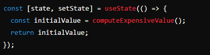

# UseReducer 
The useReducer hook in React is an alternative to useState for managing state in functional components. 
It is especially useful for managing complex state logic that involves multiple sub-values or when the next state 
depends on the previous state. useReducer is inspired by the reducer pattern commonly used in Redux.

**Purpose of useReducer**
1. **Complex State Logic**: useReducer is well-suited for cases where state transitions involve complex logic 
    or multiple state variables that need to be updated in a coordinated way.
2. **Predictable State Management**: It helps in maintaining a predictable state management pattern using actions 
    and reducers, similar to how you would manage state in Redux.

#### Syntax and Usage
The useReducer hook takes two arguments:
    1. **Reducer Function**: A function that receives the current state and an action, and returns a new state. 
    This function describes how the state changes in response to actions.
    2. **Initial State**: The initial state value or object.

   **const [state, dispatch] = useReducer(reducer, initialState);**

   **reducer**: A function that takes two arguments—state and action—and returns the new state based on the action type.
   **initialState**: The initial state value or object for the state.

   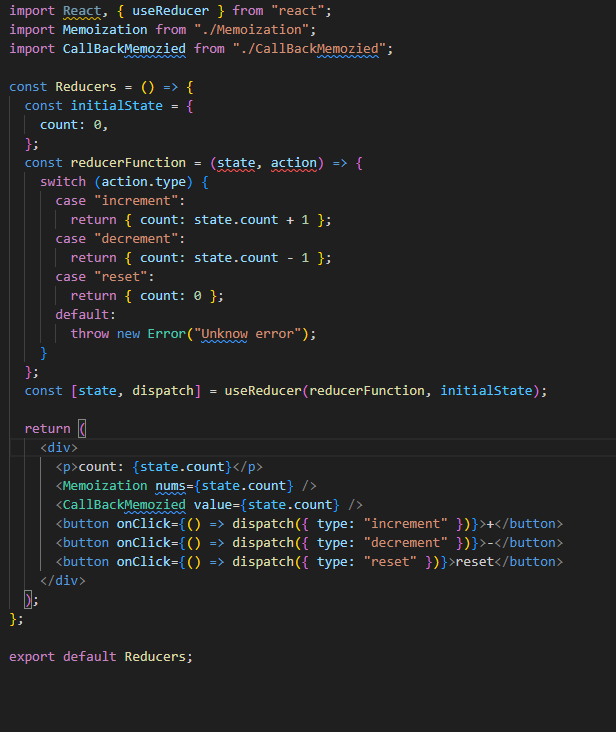

# useRef Hook: 
    The useRef hook in React is used to create and manage mutable references to DOM
    elements or values across renders without causing re-renders. It provides a way 
    to persist values across renders without causing side effects or triggering re-renders,
    which is particularly useful for accessing and interacting with DOM elements directly 
    or storing values that don't affect rendering.

**Purpose of useRef**

1. **Accessing DOM Elements**: Allows direct access to a DOM element for purposes like focusing an input, 
    measuring size, or performing animations.
2. **Persisting Values**: Useful for persisting values that should not trigger a re-render when they change, 
    such as storing previous state values or timers.
3. **Avoiding Re-renders**: Stores mutable values without causing component re-renders, unlike state which triggers 
    re-renders on updates.

**Syntax and Usage**
The useRef hook returns a mutable object with a current property that can hold any value or reference to a DOM element:

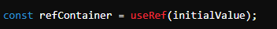

**initialValue**: The initial value to set for the current property. This value can be anything: a DOM node, a value, or null.
**refContainer.current**: This is where the useRef value is stored.

**Example**
 

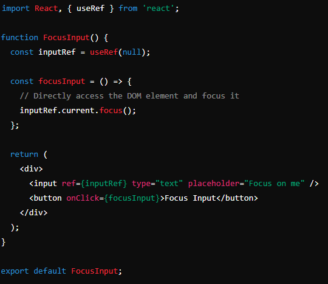

1. **ref={inputRef}**: Attaches the inputRef to the input element.
2. **inputRef.current.focus()**: Calls the focus method on the input element when the button is clicked.

### Important Points

1. **No Re-render on Update**: Unlike state, updating a useRef value does not trigger a re-render of the component.
2. **Direct DOM Manipulation**: useRef is commonly used for interacting with DOM elements directly, 
    like focusing an input, triggering animations, or accessing a component’s dimensions.
3. **Persisting Values Across Renders**: useRef is perfect for storing values that need to persist across 
    renders but shouldn’t trigger a re-render when they change.

# useContext Hook

The useContext hook in React is used to access the value of a context that was provided higher up in the component tree.
Context provides a way to pass data through the component tree without having to pass props down manually at 
every level, which is particularly useful for global or shared state like themes, authentication, or user settings.

**Purpose of useContext**
1. **Access Context Values**: It allows functional components to consume context values provided by a 
    Context.Provider without needing to use a class-based component.
2. **Avoid Prop Drilling**: Simplifies passing data through many layers of components, avoiding the need 
    to pass props down manually through intermediate components.

#### Syntax and Usage  
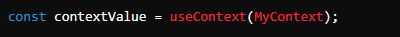

1. **MyContext**: This is the context object that you create using React.createContext().
2. **contextValue**: This is the current value of the context that is returned by useContext.

#### Example of useContext
**useAuthContext.js**
 
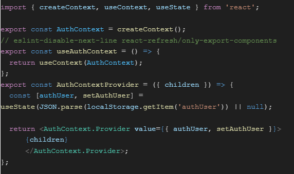

 

**main.js**
 
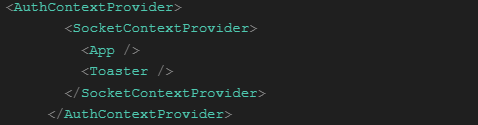

# useMemo Hook

The useMemo hook in React is used to optimize performance by memoizing the results of expensive computations 
so that they are only recalculated when their dependencies change. This can help avoid unnecessary recalculations 
and improve rendering performance, especially in components that perform heavy calculations.

#### Purpose of useMemo
1. **Performance Optimization**: It prevents re-computation of values or objects that are costly to calculate by 
    storing the result and only recalculating it when dependencies change.
2. **Avoiding Re-Renders**: Helps to prevent unnecessary re-renders of child components that rely on memoized values.

#### Syntax and Usage
**The useMemo hook takes two arguments**:
1. A function that returns the value you want to memoize.
2. A dependency array that determines when the memoized value should be recalculated.

 
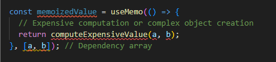
 

**First Argument**: A function that performs the expensive computation or creates a complex object.
**Second Argument**: An array of dependencies that the memoized value depends on. The memoized value is recalculated only if one of these dependencies changes.

### Example
 

**practice.js**  
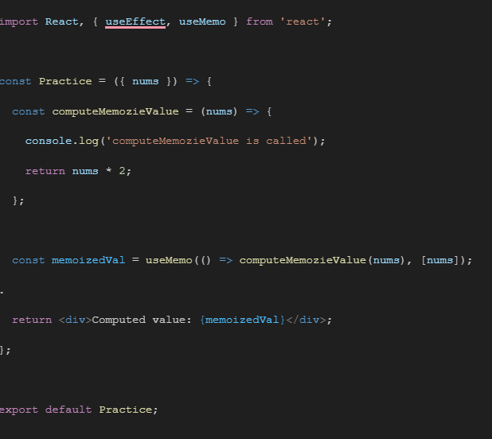

 

**main.js**  

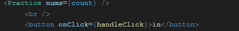

# useCallback Hook

The useCallback hook in React is used to memoize callback functions, ensuring that the same instance of the function 
is used between renders unless its dependencies change. This can be beneficial for optimizing performance, 
particularly when passing callbacks to child components or hooks that depend on stable function references.

#### Purpose of useCallback
1. **Prevent Unnecessary Re-Renders**: By ensuring that a function reference remains stable between renders, 
    useCallback helps prevent unnecessary re-renders of components that use the function as a prop.

2. **Optimize Performance**: Helps to avoid recreating functions on every render, which can be beneficial 
    for performance, especially when the function is passed to components that use React.memo or other memoization 
    techniques.

#### Syntax and Usage
**The useCallback hook takes two arguments:**
1. A callback function that you want to memoize.
2. A dependency array that specifies when the callback function should be recreated.

 
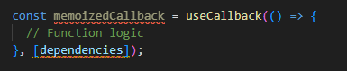
 

**First Argument**: The callback function that you want to memoize.
**Second Argument**: An array of dependencies that, when changed, will cause the callback function to be recreated.

#### Example
 
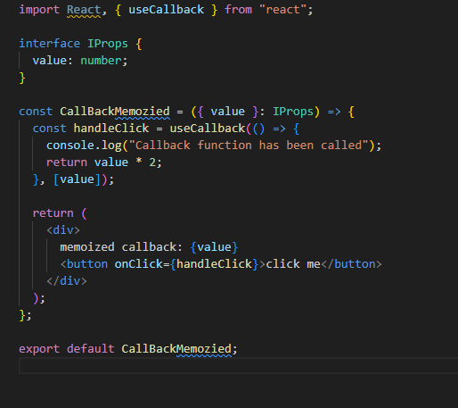
 
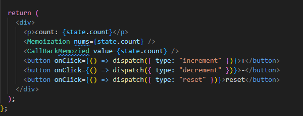

# Optimization Methods of a website in React

There are several key techniques for performance optimization:
1. ### Code Splitting:
    
    **Dynamic Imports**: Use React.lazy and Suspense to load components only when they are needed,
    reducing the initial load time.
     
    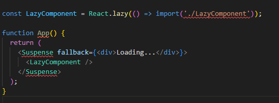

     

    **React.lazy and Suspense**: These enable loading components lazily and handling the loading state.

   

2. ### Memoization:

    
    **React.memo**: Wrap functional components to prevent unnecessary re-renders when props have not changed.
     
    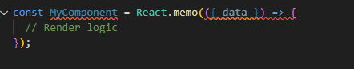
   
     

    **useMemo and useCallback Hooks**: Use these hooks to memoize expensive calculations and functions to 
    prevent re-computation on every render.

     
    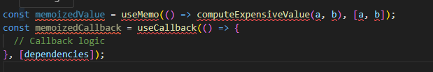
     
   

3. ### Minimize Re-renders    
    
    **Key Prop**: Ensure you provide a stable and unique key prop for list items to help React identify which items have changed.
   
    
    **Shallow Comparison**: When using React.memo, React performs a shallow comparison of props. Ensure that objects 
    and arrays are not recreated on each render unless their contents change.
   

# Pure Component

In React, a **Pure Component** is a component that only re-renders when its props or state change. 
It performs a **shallow comparison** of props and state to determine if a re-render is necessary. 
Pure components help optimize performance by avoiding unnecessary re-renders.

### Key Features of Pure Components
1. **Shallow Comparison**: A pure component performs a shallow comparison of the current and next props and state. 
    If the values are the same (i.e., if they haven't changed), the component does not re-render.

2. **React.PureComponent**: React.PureComponent is a base class provided by React that you can extend to create 
    pure components. It automatically implements shouldComponentUpdate with a shallow comparison.

     
    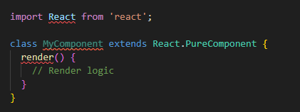

3. **Functional Components with React.memo**: For functional components, you can achieve similar behavior 
    using React.memo, which wraps the component and performs a shallow comparison of props.

     
    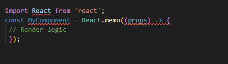

# Higher Order Component

A **Higher-Order Component (HOC)** is a pattern in React that allows you to reuse component logic across different 
components. An HOC is a function that takes a component and returns a new component with additional props or behavior.

**Function Signature**: An HOC is a function that takes a component as an argument and returns a new 
component with enhanced functionality.

 
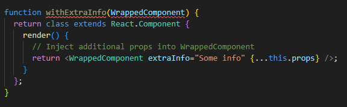

#### Usage: 
    You use an HOC by wrapping a component with the HOC function to enhance it with additional props or behavior.

# Throttling and debouncing: 

**Throttling** limits the rate at which a function can fire. It ensures that the function is not invoked more than 
    once within a specified time interval, even if the event triggering the function continues to occur.

### Use Case: 
    Throttling is useful when you want to limit the frequency of executions of a function, such as 
    handling scroll events, resizing events, or keystrokes in search inputs.
### Implementation: 
    Typically implemented by setting up a timer that delays the execution of a function until 
    after the specified interval has passed since the last invocation

**Debouncing** delays the execution of a function until after a certain amount of time has passed since 
    the last invocation of the function. It's typically used to ensure that a function doesn't fire repeatedly, 
    especially when triggered rapidly.
### Use Case: 
    Debouncing is useful for scenarios like search inputs where you want to wait until the user 
    has stopped typing before triggering a search operation.
### Implementation: 
    Achieved by setting a timer each time the function is called. If the function is called again 
    before the timer expires, the timer is reset. The function is only executed after the timer has 
    completed without further invocations.

# Difference between Class Based and Functional based Component

1. ## Syntax: 

    <ol>
    
    **Functional Components**: These are simple JavaScript functions that return JSX. They do not have
    their own state or lifecycle methods without using hooks.
     
    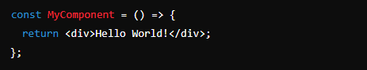
    
    </ol>
    <ol>
    
    **Class-Based Component**: These are ES6 classes that extend React.Component. 
    They come with built-in support for state and lifecycle methods.
     
    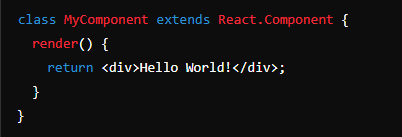
     
    </ol>

2. ## State Management:

    <ol>
    
    **Functional Component**: Originally, functional components were stateless, but with the introduction of 
    React Hooks (like useState and useEffect), they can now manage state and side effects.
     
    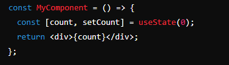     
    </ol>
    <ol>
    
    **Class-Based Component**: Class components have built-in state management using this.state and this.setState().
     
    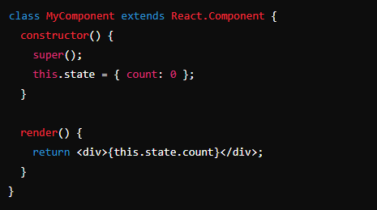
    </ol>

3. ## Lifecycle Methods:

    <ol>
    
    **Functional Component**:  Do not have lifecycle methods, but you can replicate the behavior using
    hooks like useEffect, which combines componentDidMount, componentDidUpdate, and componentWillUnmount.
     
    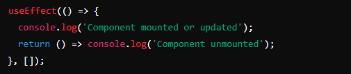
    </ol>
    <ol>
    
    **Class-Based Component**: Have dedicated lifecycle methods such as componentDidMount, 
    componentDidUpdate, componentWillUnmount, etc.
     
    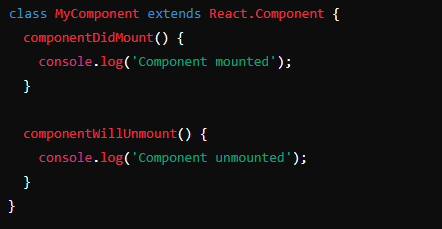
    </ol>

4. # Hooks Support
     <ol>
    
    **Functional Component**: You can use React Hooks (like useState, useEffect, useContext, etc.) only in 
    functional components.
    </ol>
    <ol>
   
    **Class-Based Component**: Do not support hooks. They rely on state and lifecycle methods for 
    similar functionality.
    </ol>

5. # Performance
     <ol>
   
    **Functional Component**: With hooks, functional components tend to be slightly more performant 
    due to fewer complexities compared to class components, especially after React introduced 
    improvements like React.memo and useCallback to optimize re-renders.
    
    </ol>
    <ol>
    
    **Class-Based Component**: Are generally more complex due to the use of this keyword and lifecycle methods, 
    which can lead to more overhead in certain cases.
    
    </ol>

6. # Readability and Conciseness
      <ol>
   
    **Functional Component**: Tend to be more concise and easier to read, especially for simple UI components or logic.
    
    </ol>
    <ol>
    
    **Class-Based Component**: Can become verbose due to the need for constructor functions, 
    this bindings, and lifecycle methods
    
    </ol>

