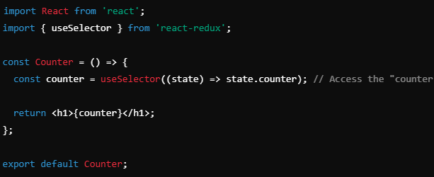

<li><a href="#coreRedux">Core principle of Redux</a></li>
<li><a href="#reduxApp">Explain the structure of redux application</a></li>
<li><a href="#actions">What is the role of actions in Redux? Can you provide an example?</a></li>
<li><a href="#connectFunction">What is the purpose of connect() in Redux?</a></li>
<li><a href="#mapStateAndDispatch">What is mapStateToProps and mapDispatchToProps</a></li>
<li><a href="#hook">Redux Hook</a></li>
<li><a href="#middleware">What is middleware in the redux?</a></li>

# Core Principle Of Redux

The core principles of Redux are foundational concepts that guide its design and usage. 
They ensure state management is predictable, scalable, and easy to debug. Here are the key principles:

1. **Single Source of Truth**

The state of the entire application is stored in a single JavaScript object tree (the store).
This centralized state ensures that the application state is consistent and easily accessible.

**Benefits**:

Simplifies debugging.
Provides a single point to inspect and manipulate state.
Enables features like time-travel debugging.

2. **State is Read-Only**

The state can only be changed by dispatching actions.
Actions are plain JavaScript objects that describe what happened (e.g., { type: 'INCREMENT' }).

**Benefits**:

Ensures state changes are predictable and controlled.
Makes the application easier to test and debug.
Prevents accidental state mutations.

3. **Changes are Made with Pure Functions**

To specify how the state changes in response to actions, you write reducers.
A reducer is a pure function that takes the current state and an action as arguments and returns a new state.

**Characteristics of Pure Functions**:

No side effects (e.g., API calls or modifying the arguments).
Returns the same output for the same input.
Does not modify the original state; instead, it creates a new state object.

**Benefits**:

Predictable state transitions.
Easy to test individual reducers.

# Structure of redux Application
A Redux application typically follows a well-defined structure that organizes its 
components and logic into specific layers. This structure promotes scalability, 
maintainability, and readability. Here's a breakdown of the common structure:

1. ### **Store**
The store is the central hub of the Redux application, holding the entire application's state tree.
It is created using the createStore function (or configureStore in Redux Toolkit).
The store also integrates middleware and enhancers for additional functionality, such as 
logging, handling asynchronous actions, and debugging.

2. ### **Reducers**
Reducers are pure functions that specify how the state should change in response to actions.
They take the current state and an action as arguments and return a new state.
Reducers are usually organized by feature and combined using the Reducers function.

3. ### **Actions**
Actions are plain JavaScript objects that describe events or intentions to change the state.
They must have a type property (a string) and can optionally include a payload for additional data.

4. ### **Action Creators**
Functions that return action objects to encapsulate the creation of actions.
They make code more reusable and readable.

5. ### **Middleware**
Middleware is used to extend Redux with custom functionality, such as logging, 
asynchronous operations (e.g., API calls), or analytics.
Examples: redux-thunk, redux-saga.

6. ### **Selectors**
Functions to encapsulate and reuse logic for accessing specific parts of the state.
They help keep components clean by abstracting state access logic.

# Actions in Redux
In Redux, **actions** are plain JavaScript objects that represent an intention to change the state of the
application. They are dispatched to the Redux store to indicate that something has happened 
(e.g., user interaction, API response).

## Key Features of Actions:
1. **Plain Object**: Actions are plain JavaScript objects.
2. **Mandatory type Field**: Every action must have a type property, which is a string that describes the action.
3. **Payload (Optional)**: Actions can include additional data (payload) required to update the state.

# Connect()

In Redux, the **connect()** function is used to link React components with the Redux store. 
It allows components to access the state and dispatch actions to update the state. 
This is done by connecting the component to specific slices of the Redux state 
and providing it with functions to dispatch actions.

## Key Purposes of connect():
1. **Access State**: Enables components to read specific pieces of state from the Redux store.
2. **Dispatch Actions**: Provides components with functions to dispatch actions to the store.
3. **Separate Concerns**: Keeps the component logic separate from the Redux store, 
making the component more reusable and easier to test.

**Syntax**:

# mapStateToProps
**mapStateToProps** is a function that takes the Redux state as its first argument 
and maps parts of that state to the component's props. This allows the component 
to access specific slices of the Redux state.

**Purpose**

To specify what parts of the Redux state the component needs and map them as props.

**Syntax**:

**Example**
If your Redux state looks like this:

You can map the counter value to your component like this:

In your component:

# mapDispatchToProps

**mapDispatchToProps** is a function that takes the dispatch function as its 
first argument and maps action dispatching functions to the component's props. 
This allows the component to dispatch actions to the Redux store.

**Purpose**
To create functions that dispatch actions and make them available as props in the component.

**Syntax**

**Example**

**Redux hooks** are part of the React Redux library and provide a simpler and more modern way
to interact with the Redux store in functional components. They eliminate the need for the 
**connect()** function and allow you to directly access the store and dispatch actions.

The two main hooks provided by React Redux are

1. ### useSelector()
The useSelector hook allows you to access specific parts of the Redux state.

**Syntax**

**const selectedState = useSelector((state) => state.someSlice);**

**example**:

2. ### useDispatch()
The useDispatch hook provides a reference to the dispatch function, 
which is used to dispatch actions to the Redux store.

**Syntax**

**const dispatch = useDispatch();**

**dispatch(action);**

**example**

### Benefits of Redux Hooks
1. **Simplicity**: Hooks are simpler and require less boilerplate compared to connect().
2. **Component Independence**: Components no longer need to be wrapped in connect(), making them more reusable.
3. **Better TypeScript Support**: Type inference is easier with hooks.
4. **Direct Access**: Hooks allow direct access to the state and dispatch functions.

In Redux, middleware is a way to extend the behavior of the dispatch function. 
It provides a third-party extension point between dispatching an action and 
the moment it reaches the reducer. Middleware allows you to:

1. Handle asynchronous operations (e.g., API calls).
2. Log, modify, or halt actions.
3. Add custom logic to dispatching actions.
4. Think of middleware as a pipeline that actions pass through before reaching the reducers.

### How Middleware Works
When an action is dispatched:

1. The action first goes through the middleware.
2. Middleware can modify, log, delay, or even stop the action.
3. The middleware passes the action to the next middleware in the chain (if any) or directly to the reducer.

### Diagram

Dispatch Action → Middleware 1 → Middleware 2 → Reducer

## Common Middleware Libraries
1. ### Redux Thunk
Enables dispatching functions (instead of just objects).
Useful for making asynchronous calls.

2.  ### Redux Saga
Uses generator functions for managing side effects like API calls.
Provides advanced control over asynchronous flows.

## How to Add Middleware to Redux
Middleware is applied using the applyMiddleware function from Redux.

## Benefits of Middleware
1. **Asynchronous Actions**: Handle async operations like API calls without complicating the reducer logic.
2. **Centralized Logic**: Middleware provides a central location to add behavior, such as logging or error handling.
3. **Extensibility**: Add or remove middleware to modify the behavior of your Redux store without touching the reducers.

## Middleware Flow in Redux
1. An action is dispatched.
2. The action passes through all middleware sequentially.
3. Middleware can:
    a. Modify the action.
    b. Perform side effects (e.g., API calls).
    c. Stop the action.
4. The action reaches the reducers if not stopped.

## When to Use Middleware
1. **Async Operations**: Fetching data, handling side effects, etc.
2. **Logging**: Track actions and state changes during development.
3. **Custom Logic**: Add conditions or filters for specific actions.

