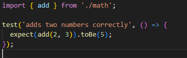
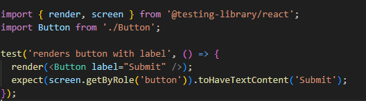
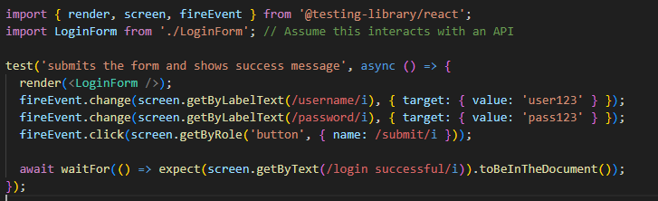
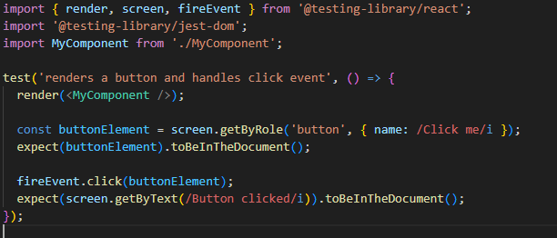

# RTL (React Testing Library)

<li>What is the difference between unit tests, integration tests, and end-to-end tests? When would you use each type?</li>
<li><a href="#RTL">About React Testing Library</a></li>

<li><a href="Shallow_rendering">Shallow rendering </a></li>
<li></li>
<li></li>
<li></li>
<li></li>
<li></li>
<li></li>
<li></li>
<li></li>
<li></li>
<li></li>

# What is the difference between unit tests, integration tests, and end-to-end tests? When would you use each type?

## Unit Test:
Unit tests are focused on testing individual units of code, typically single functions,
methods, or components in isolation. The purpose of unit testing is to ensure that each 
unit behaves as expected, given specific inputs.

1. **What is Tested**: Small, individual pieces of code such as functions or React components.
2. **Tools**: Jest, Vitest, Mocha, React Testing Library (RTL) for component unit testing.
3. **Example**: Testing if a function correctly adds two numbers or if a React component 
    renders the correct UI given specific props.
4. **When to Use**: Use unit tests when you want to ensure that small, isolated units of 
    your application behave correctly and reliably. They are the foundation of a test suite 
    and offer fast feedback.

###

###

###

## Integration Test: 
Integration tests verify that multiple components or modules work together as expected. 
Instead of focusing on individual units, integration tests test the interactions between 
different parts of the system.

1. **What is Tested**: How different modules, components, or services work 
    together (e.g., React components interacting with each other or APIs).
2. **Tools**: Jest, RTL, Supertest (for API integration tests), 
    Cypress (can be used for integration tests).
3. **Example**: Testing if a form correctly submits data and updates the UI 
    by interacting with multiple components or services (like an API).
4. **When to Use**: Use integration tests to ensure that your components 
    and services interact properly. For example, you may want to ensure that
    when a form is submitted, the data is processed correctly and the UI updates.

###

###
## End-to-end Test: 
End-to-end tests simulate real user interactions with the application by testing the entire flow, from the user interface to the backend and database. E2E tests verify that the entire application works as expected in real-world scenarios.

What is Tested: The complete application flow, including user interface, APIs, and databases, ensuring that all parts of the system function together from a user’s perspective.
Tools: Cypress, Playwright, Selenium.
Example: Testing if a user can successfully log in, navigate through the application, and perform actions like submitting forms or making purchases.
When to Use: Use E2E tests for critical user journeys, such as logging in, making a purchase, or navigating through the application. They provide the highest level of confidence that your system works as expected but tend to be slower and more complex to maintain.

# React Testing Library

 RTL in the context of React development typically refers to React Testing Library (RTL),
a popular tool for testing React components.

## Key Features of React Testing Library (RTL)

<li><b>Focus on user behavior:</b>  RTL encourages writing tests that mimic how a user interacts 
with the application. It promotes testing the component as it is used in the browser 
rather than testing implementation details.</li>
<li><b>No shallow rendering:</b> Unlike other testing libraries like Enzyme, RTL doesn't support 
shallow rendering. It renders components in the DOM to better simulate the actual application behavior.</li>
<li><b>Selectors based on accessibility:</b> RTL promotes selecting elements using methods like getByText, 
getByRole, and getByLabelText, which align with how users and screen readers interact with the app.</li>
<li><b>Encourages best practices:</b> It pushes developers toward writing maintainable tests that can survive
refactoring since the tests focus on the output of the component rather than internal details.</li>
    
####

#### In this example:

<li><b>render:</b> Renders the component into a virtual DOM.</li>
<li><b>screen:</b> Allows access to various query methods for finding elements in the DOM.</li>
<li><b>fireEvent:</b> Simulates user actions like clicking.</li>
<li><b>expect:</b> Part of Jest, used to assert that the component behaves as expected.</li>

Since you use Vitest with React Testing Library, RTL would be your main tool for testing React components in a user-centric way.

#  Shallow rendering 
**Shallow rending** is a testing technique in which only the component being tested is rendered, 
without rendering its child components. This method is useful for unit testing because it 
isolates the component under test, allowing developers to focus on its behavior and outputs 
without worrying about its dependencies.

However, React Testing Library (RTL) does not support shallow rendering. Instead, RTL advocates 
for full rendering of components into the DOM and testing them as closely as possible to how they 
will be used by a real user. RTL's philosophy focuses on testing components in a manner that 
reflects how they behave in the browser, including how they interact with their child components.

